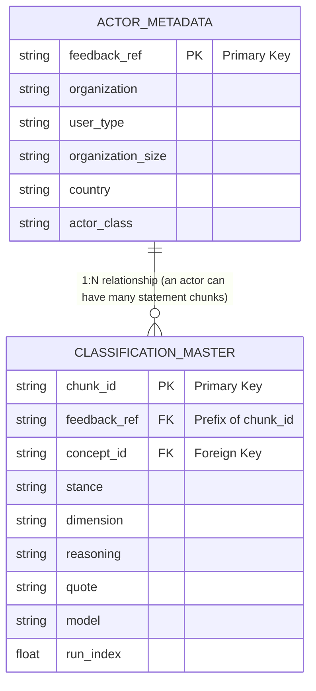

```mermaid
erDiagram
    ACTOR_METADATA {
        string feedback_ref PK "Primary Key"
        string organization
        string user_type
        string organization_size
        string country
        string actor_class
    }
    
    CLASSIFICATION_MASTER {
        string chunk_id PK "Primary Key"
        string feedback_ref FK "Prefix of chunk_id"
        string concept_id FK "Foreign Key"
        string stance
        string dimension
        string reasoning
        string quote
        string model
        float run_index
    }
    
    ACTOR_METADATA ||--o{ CLASSIFICATION_MASTER : "1:N relationship (an actor can have many statement chunks)"
```
