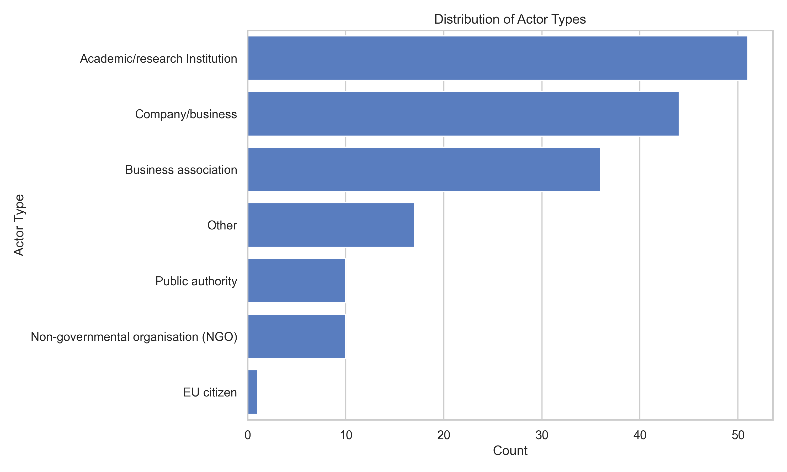
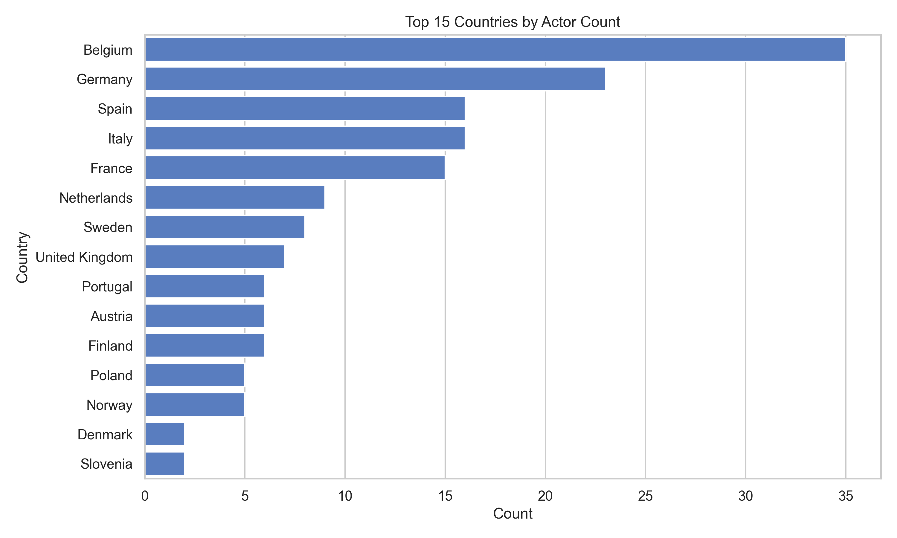
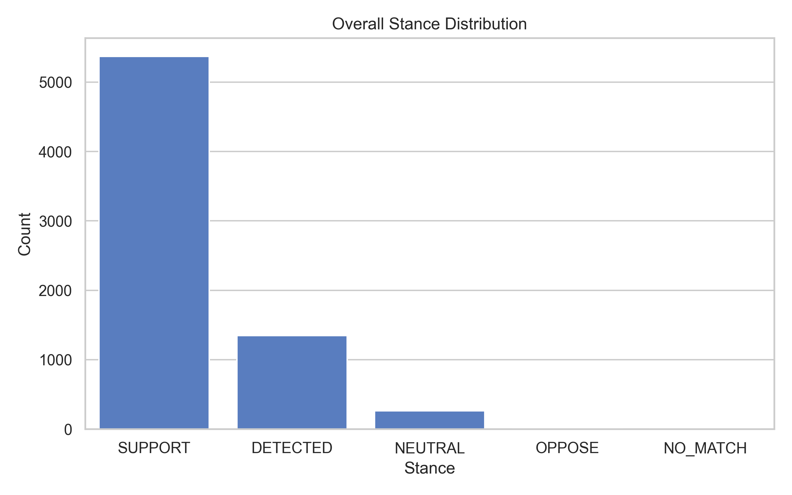
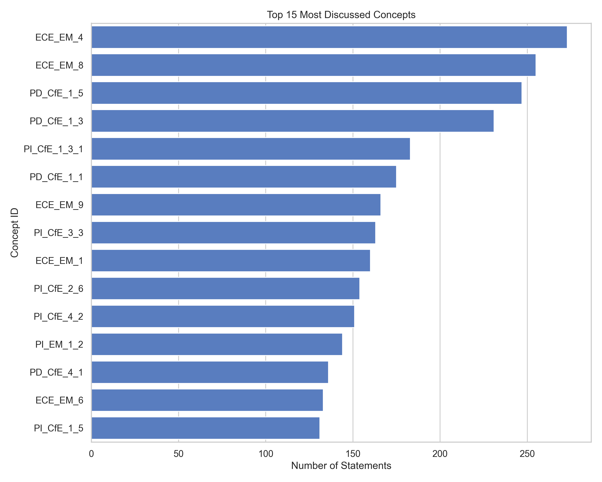
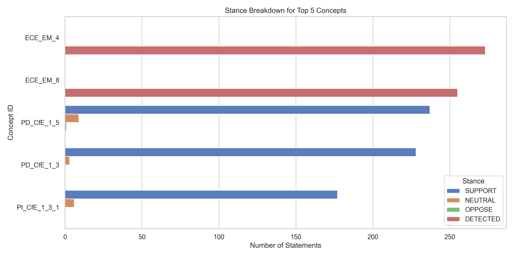

# AMA Consultation Data Visualizations

I have generated several visualizations based on the `actor_metadata_refined.csv` and `classification_master_refined.csv` datasets to give you a clear overview of the data landscape.

## Actor Metadata Overview

### Distribution of Actor Types
This chart shows the breakdown of the types of actors who participated in the consultation.

### Top 15 Countries by Actor Count
Here is the geographic distribution of the actors, focusing on the top 15 most represented countries.

## Classification Overview

### Overall Stance Distribution
This bar chart displays the overall stance (e.g., SUPPORT, OPPOSE, NEUTRAL) across all the extracted statements and classifications.

### Top 15 Most Discussed Concepts
The concepts most frequently referenced within the consultation text.

### Stance Breakdown for Top 5 Concepts
A closer look at the top 5 most discussed concepts, segmented by the stance of the actors regarding each concept.

---
*Generated using Python `pandas` and `seaborn` directly from the raw dataset.*
